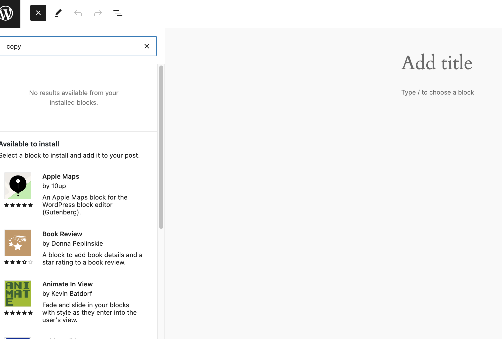
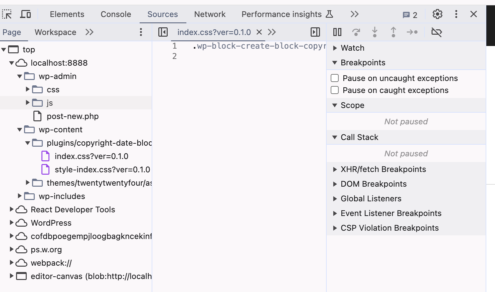

### Steps
1. Create a block plugin by command:
```shell
npx @wordpress/create-block@latest copyright-date-block --variant=dynamic
```
2. Enter copyright-date-block and start wp-env:
```shell
wp-env start
```

3. Visit http://localhost:8888, login, and make sure the copyright date block plugin is activated.

4. Click "New" to the page for creating a new post/page, Click the add icon to open the blocks, search "copy"



### Other information
1. In web dev tools, there is only css being loaded.
   
2. block.json and index.js is able to be visited in url. So it is deployed to the server.
3. Not use wp-env, but copy the build folder and copyright-date-block.php to another wordpress environment, the problem still exists.

### Environment information
1. node.js version: 20.14.0
2. npm version: 10.7.0
